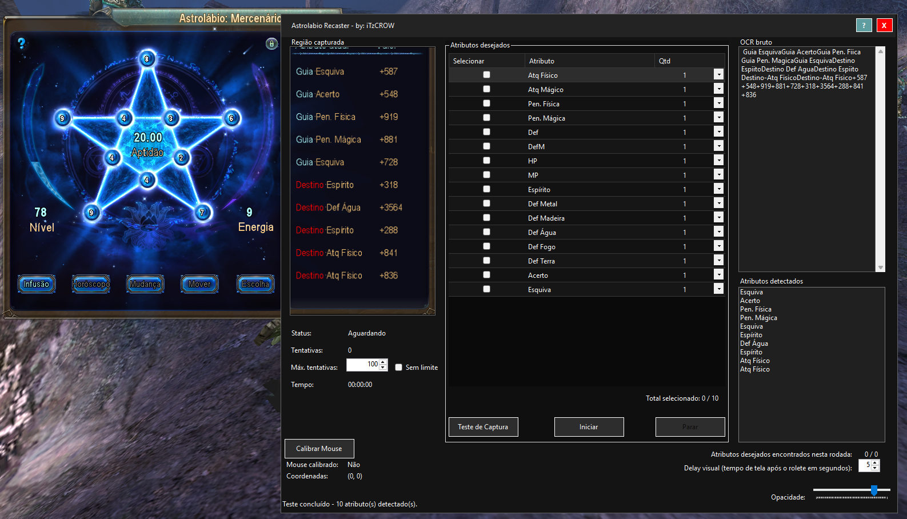

# Astrolábio Recaster

Leitor de atributos do Astrolábio e ferramenta de reroll automática para Perfect World, desenvolvido em C# (.NET 8) utilizando OCR (Tesseract) e WinForms.

Essa ferramenta lê os atributos do Astrolábio diretamente da tela do jogo e faz o reroll automaticamente até encontrar os atributos desejados.

---

# Screenshot

---

# Funcionalidades

- Detecção OCR dos atributos do Astrolábio

- Comparação automática de atributos

- Sistema de reroll automatizado

- Calibração de clique do mouse

- Atraso visual ajustável

- Sistema de seleção de atributos

- Visualização em tempo real da detecção dos atributos

- Contador de tentativas

- Timer de execução

---

# Tecnologias Utilizadas

---

# Download

Baixe a versão compilada mais recente na seção Releases:

https://github.com/nathangsc93/Astrolabio-Recaster/releases

Baixe o arquivo .zip, extraia e execute;

---

# Instalação

1. Baixe a versão mais recente
2. Extraia o arquivo `.zip`
3. Execute

Nenhuma instalação necessária.

---

# Uso

1. Abra a janela do Astrolábio no Perfect World
2. Posicione a ferramenta sobre a área de atributos
3. Clique em **Calibrar Mouse**
4. Configure os atributos desejados
5. Clique em **Iniciar**
6. A ferramenta irá roletar até os atributos desejados aparecerem ou acabarem os recursos

---

# Estrutura do Projeto

Astrolabio Recaster
│
├── Serviços
│ ├── ScreenCaptureService
│ ├── OcrService
│ ├── StatParser
│ ├── StatMatchService
│ └── ImagePreprocessService
│
├── tessdata
│ └── eng.traineddata
│
├── Astrolabio Recaster.cs
├── Program.cs
└── Astrolabio Recaster.csproj

---

# Autor

Nathan Corrêa
nathangsc.dev@gmail.com

GitHub  
https://github.com/nathangsc93

---

# Licença

Copyright (c) 2026 Nathan Corrêa

Todos os direitos reservados.

Este software não pode ser distribuído ou utilizado sem permissão explícita do autor.
